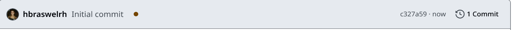

## Bite-sized ComplyTime Outline 🥮

#### 1. Introducing ComplyTime Organization Repositories
  - **Goal:** Get users comfortable with repository interaction and location of work.
  - **Action:** Provide a one-stop shop for repository contents, highlighting the purpose, resources, and best practices for reference.
#### 2. Create Personal Sandbox
  - **Goal:** Empower and educate users in a reproducible environment. 
  - **Action:** Use [Public repository template](https://docs.github.com/en/repositories/creating-and-managing-repositories/creating-a-repository-from-a-template) to create your own OSCAL Content sandbox. 
#### 3. Automate OSCAL Content Updates via GitHub Actions
  - **Goal:** Understand practical interaction with ComplyTime tools using automation.
  - **Action:** Leverage GitHub Actions in the GitHub UI for creating and updating OSCAL Content. 
 
